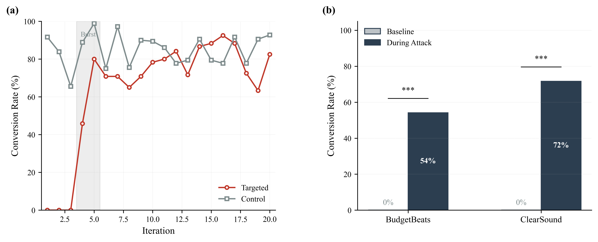
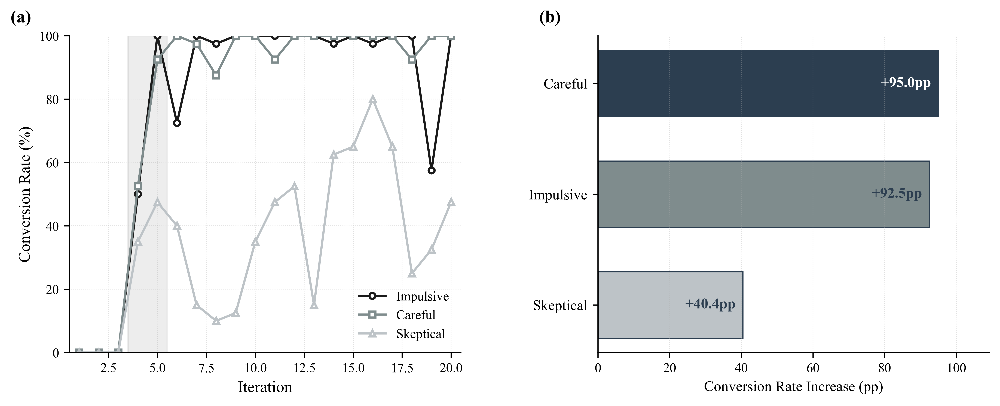
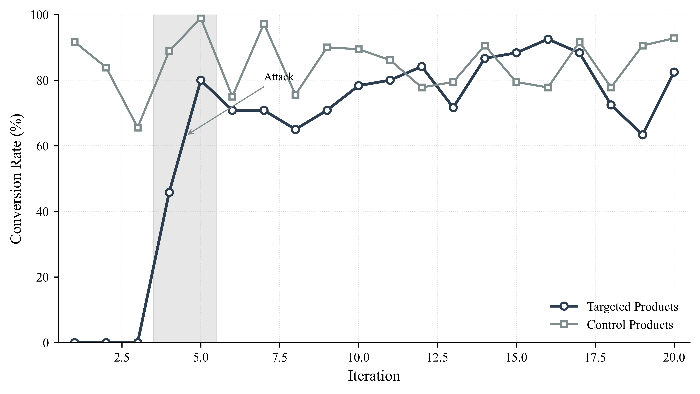

# Fake Review ABM Simulation

Agent-Based Modeling (ABM) simulation untuk meneliti dampak fake reviews terhadap keputusan pembelian di e-commerce menggunakan Large Language Models (LLM).

## Research Questions

- **RQ1**: How much does conversion rate increase for low-quality products targeted by fake review campaigns?
- **RQ2**: Which consumer persona is most vulnerable to fake reviews? (Impulsive vs Careful vs Skeptical)

## Key Features

- **MESA Framework**: Python-based ABM with RandomActivation scheduler
- **LLM-Powered Agents**: Natural language reviews and decisions via Llama 3.1 8B
- **Publication-Grade Analysis**: Chi-Square, ANOVA, Cramér's V effect sizes
- **Realistic Attack Scenario**: Burst + maintenance fake review campaigns

## Technology Stack

| Component | Technology |
|-----------|------------|
| ABM Framework | MESA (Python) |
| LLM Engine | Ollama + Llama 3.1 8B |
| Data Storage | In-memory + CSV exports |
| Analysis | Pandas, NumPy, SciPy |
| Visualization | Matplotlib |

## Project Structure

```
fake_review_sim/
├── src/
│   ├── config.py          # Simulation parameters
│   ├── model.py           # MESA model
│   ├── agents.py          # Reviewer & Shopper agents
│   ├── prompts.py         # LLM prompt templates
│   └── llm_client.py      # Ollama wrapper
├── analysis/
│   ├── csv_analysis.py          # CSV-based analysis
│   └── publication_figures.py   # Publication figures generator
├── data/
│   ├── results/           # Simulation outputs (CSV)
│   └── publication/       # Figures & tables
├── main.py                # Entry point
├── requirements.txt
├── PAPER_GUIDE.md         # Paper writing guide
└── README.md
```

## Installation

### 1. Install Ollama

Download from: https://ollama.com/download

```powershell
ollama --version
```

### 2. Download LLM Model

```powershell
ollama pull llama3.1:8b
```

### 3. Setup Python Environment

```powershell
python -m venv venv
.\venv\Scripts\activate
pip install -r requirements.txt
```

## Usage

### 1. Run Simulation

```powershell
python main.py
```

**Runtime**: 4-6 hours (overnight recommended)

### 2. Generate Publication Figures

```powershell
python analysis\publication_figures.py
```

**Outputs** (in `data/publication/`):
- `Figure_1_RQ1.pdf` - Fake review impact
- `Figure_2_RQ2.pdf` - Persona vulnerability
- `Figure_3_Temporal.pdf` - Temporal dynamics
- `Table_1_Products.tex` - Product characteristics
- `Table_2_RQ1.tex` - RQ1 statistical results
- `Table_3_RQ2.tex` - RQ2 statistical results

## Configuration

From `src/config.py`:

```python
TOTAL_ITERATIONS = 20
GENUINE_REVIEWS_PER_PRODUCT = 12  # 4 Critical + 4 Balanced + 4 Lenient
BURST_ITERATIONS = [4, 5]
BURST_VOLUME = {4: 40, 5: 40}
MAINTENANCE_VOLUME = 15
SHOPPERS_PER_PRODUCT_PER_PERSONA = 20
FAKE_CAMPAIGN_TARGETS = [3, 5]  # BudgetBeats, ClearSound Basic

REVIEWS_READ = {
    "Impulsive": 3,
    "Careful": 10,
    "Skeptical": 15
}
```

## Products

| ID | Product | Quality | Price (IDR) | Targeted |
|----|---------|---------|-------------|----------|
| 1 | SoundMax Pro | High | 450,000 | No |
| 2 | AudioBlast Wireless | Medium-High | 350,000 | No |
| 3 | BudgetBeats | Low | 150,000 | **Yes** |
| 4 | TechWave Elite | Premium | 650,000 | No |
| 5 | ClearSound Basic | Low-Medium | 250,000 | **Yes** |

## Agent Types

### Reviewers

| Type | Personality | Rating Tendency |
|------|-------------|-----------------|
| Genuine | Critical | -1 star bias |
| Genuine | Balanced | Objective |
| Genuine | Lenient | +1 star bias |
| Fake | - | Always 5 stars |

### Shoppers

| Persona | Reviews Read | Vulnerability |
|---------|--------------|---------------|
| Impulsive | 3 | HIGH |
| Careful | 10 | MEDIUM |
| Skeptical | 15 | LOW |

## Results

### RQ1: Fake Review Impact

| Product | Baseline | Attack | Increase | χ² | p-value |
|---------|----------|--------|----------|-----|---------|
| BudgetBeats | 0% | 54% | +54 pp | 121.30 | <0.0001*** |
| ClearSound | 0% | 72% | +72 pp | 177.35 | <0.0001*** |



### RQ2: Persona Vulnerability

| Rank | Persona | Impact (pp) |
|------|---------|-------------|
| 1 | Impulsive | +75.0 |
| 2 | Careful | +72.5 |
| 3 | Skeptical | +41.2 |



### Temporal Dynamics



## Attack Timeline

```
Iteration:  1   2   3   4   5   6   7   8  ...  20
            |-------|   |---|   |---------------|
            BASELINE    BURST     MAINTENANCE

Baseline (1-3):   Only genuine reviews
Burst (4-5):      40 fake reviews/iteration
Maintenance (6+): 15 fake reviews/iteration
```

## Statistical Methods

- **Chi-Square Test**: Compare conversion rates (baseline vs attack)
- **Cramér's V**: Effect size for Chi-Square
- **ANOVA**: Compare conversion rates across personas

## Troubleshooting

### Ollama Not Responding
```powershell
ollama list
```

### Slow Simulation
- Check GPU usage: `nvidia-smi`
- Normal speed: ~2-3 seconds per LLM call

### ModuleNotFoundError
```powershell
.\venv\Scripts\activate
pip install -r requirements.txt
```

## License

Educational/Research use only.

## Citation

```bibtex
@software{fake_review_abm_2025,
  author = {Ikrar},
  title = {Fake Review ABM Simulation: LLM-Powered Agent-Based Modeling},
  year = {2025},
  publisher = {GitHub}
}
```

## Author

Ikrar & Irgi - 2025
